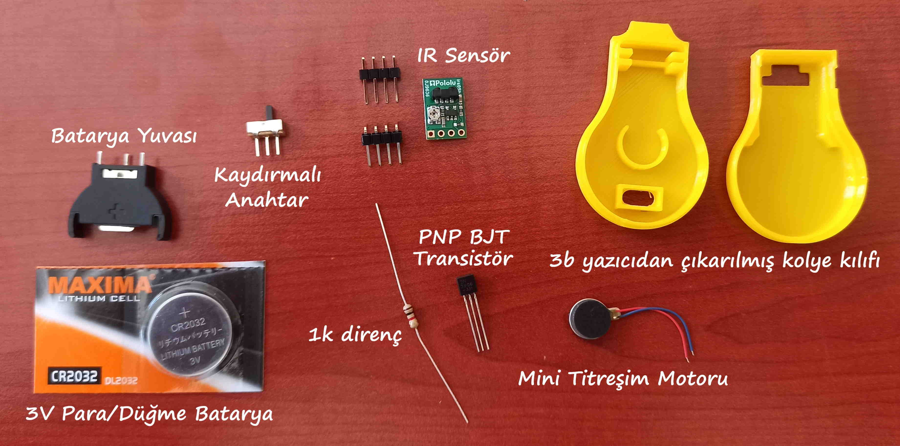

# PULSE - yüzünüze dokunmak istediğinizde sizi uyaran kolye
## Gerekli malzemeler ve sipariş edebileceğiniz bağlantı

*Şekil 1.* Koronavirüs kolyesi projesinde kullanılan malzeme ve devre elemanları (NASA).

1. Robo90 tarafından hazırlanmış toplu paket: Elektronik Kolye  [Buradan Sipariş Edebilirsiniz](https://www.robo90.com/elektronik-kolye)

 
*Şekil 2.* Koronavirüs kolyesi projesinde kullanılan malzeme ve devre elemanları (*Robo90.com*).

## Kolye Kabı 3b Tasarım

The PULSE pendant case was designed to hold the existing parts. Other pendant designs can be created as desired as long as the IR sensor will fit and has a clear view to the front of the pendant.
 
If not using black material for case, the bottom of the IR emitter will need to be painted black or covered with black electrical tape to absorb any light. If this is not done, the sensor will read false motion and vibrate continuously. Only the flat bottom, do not cover the whole LED.

[STL dosyalarını buradan indirebilirsiniz](https://github.com/nasa-jpl/Pulse/tree/master/CAD)

## Devre Şeması

Devre şemasında U1 ile ile gösterilen infrared sensör çıkışı olan 3 no'lu pinde elimiz (veya herhangi bir nesne) sensöre yaklaşmadığı (yani normal) durumda 3V'a yakın bir değer üretiyor, ve D1 ile ile gösterilen LED dedektör elimiz (veya herhangi başka bir nesne) yaklaştığında yaklaşık olarak 1V üretiyor. L1 is the radiating infrared LED. When pin 3 goes low, it powers the PNP transistor (Q1) to energize the motor (M1) causing it to vibrate and the pendant to pulse. V1 is the 3 V battery in the case and S1 is the slide switch. Pin 4 on the infrared sensor is an enable input and is not used.

### In The Press

* Radio interview with KNX LA 1070 AM
* Featured on KTLA channel 5 morning news and ABC LA channel 7 June 30, 2020
* Live via zoom on Fox channel 26 Morning Show, Houston, Wednesday July 1, 2020

1. [Techcrunch](https://techcrunch.com/2020/06/25/nasas-jpl-open-sources-an-anti-face-touching-wearable-to-help-reduce-the-spread-of-covid-19/)
1. [USATODAY](https://www.usatoday.com/story/tech/2020/06/29/dont-touch-your-face-nasa-developed-necklace-remind-you/3277469001)
1. [Mashable](https://mashable.com/article/nasa-coronavirus-pulse-necklace/)
1. [Daily Mail](https://www.dailymail.co.uk/sciencetech/article-8472289/NASA-designs-necklace-simulates-nudge-person-attempts-touch-face.html)
1. [CNet](https://www.cnet.com/health/nasa-necklace-fights-coronavirus-by-reminding-you-not-to-touch-your-face/)
1. [UK News (United Kingdom)](https://uk.news.yahoo.com/nasas-jpl-open-sources-anti-214029542.html?guccounter=1)
1. [Engadget](https://www.engadget.com/nasa-coronavirus-covid-19-necklace-jpl-stop-touching-your-face-194312229.html)
1. [GovTech](https://www.govtech.com/question-of-the-day/Question-of-the-Day-for-06292020.html)
1. [SlashGear](https://www.slashgear.com/nasa-pulse-necklace-is-a-clever-diy-solution-to-prevent-face-touching-26626595/)
1. [TheDenverChannel](https://www.thedenverchannel.com/news/national/nasa-creates-pendant-to-remind-you-not-to-touch-your-face-amid-pandemic)
1. [TechTimes](https://www.techtimes.com/articles/250648/20200627/covid-19-cure-this-nasa-necklace-can-save-you-from-coronavirus-heres-how.htm)
1. [TrendHunter](https://www.trendhunter.com/trends/3d-printed-pendant-necklace)
1. [Cosmopolitan](https://www.cosmopolitan.in/life/features/a20612/nasa-designs-pulse-necklace-prevent-spread-coronavirus)
1. [Futurism](https://futurism.com/the-byte/nasa-wearable-scolds-touching-face)
1. [NewsMax](https://www.newsmax.com/health/health-news/nasa-pendant-pulse-touch/2020/06/29/id/974670/)
1. [Houston Chronicle](https://www.houstonchronicle.com/news/space/article/NASA-designed-pendant-vibrates-before-you-touch-15377186.php)
1. [MSN](https://www.msn.com/en-us/Health/wellness/coronavirus-nasa-invented-a-wearable-that-reminds-you-not-to-touch-your-face/ar-BB166pJT?ocid=a2hs)
1. [CoronaCOVID19](https://www.corona-covid19.be/world/corona-nasa-designed-a-vibrating-necklace-to-help-you-stop-touching-your-face/)
1. [PublicReleases](http://publicreleases.com/index.php/2020/06/26/to-help-reduce-the-spread-of-covid-19-nasas-jpl-creates-an-anti-face-touching-necklace/)
1. [PasadenaNow](https://www.pasadenanow.com/main/jpl-scientists-invent-necklace-to-help-combat-covid-19-give-away-blueprints/)
1. [NewsErector](https://www.newserector.com/nasa-introduced-a-necklace-which-warns-its-wearer-not-to-touch-their-face)
1. [InceptiveMind](https://www.inceptivemind.com/nasa-pulse-pendant-reminds-users-not-touch-faces/14071/)
1. [3DPrintingDesign](http://www.3dprintingdesign.es/en/new/a-3d-printed-necklace-that-prevents-you-from-touching-your-face)
1. [FirstPost](https://www.firstpost.com/tech/science/coronavirus-outbreak-nasa-develops-pulse-pendant-supposed-help-keep-hands-away-face-8540481.html)
1. [8NewsNow](https://www.8newsnow.com/news/local-news/nasa-wearable-necklace-reminds-you-not-to-touch-your-face/)
1. [Telecino (Spain)](https://www.telecinco.es/informativos/tecnologia/colgante-disenado-nasa-evitar-tocarte-cara-contagio-coronavirus-be5ma_18_2971770181.html)
1. [Tivi (Finland)](https://www.tivi.fi/uutiset/nasan-keksinto-yrittaa-vahentaa-koronaviruksen-leviamista-kaulakoru-estaa-kasvojen-koskemisen/07645c61-0079-4207-91b9-3c09c1c00a36)
1. [GCN](https://gcn.com/articles/2020/07/02/nasa-pulse-face-touch-warning-wearable.aspx)
1. [India Times (India)](https://timesofindia.indiatimes.com/life-style/health-fitness/health-news/nasa-invents-a-pendent-that-stops-you-from-touching-your-face/articleshow/76750654.cms)
1. [Yahoo! news](https://ca.news.yahoo.com/nasas-jpl-open-sources-anti-214029542.html)
1. [Tribune (Pakistan)](https://tribune.com.pk/story/2252658/nasa-invents-wearable-that-scolds-you-for-touching-your-face)
1. [Groupo Fórmula (Mexico)](https://www.radioformula.com.mx/vida-y-estilo/20200713/nasa-crea-collar-covid-coronavirus-evita-que-te-toques-la-cara/)
1. [El Tiempo (Colombia)](https://www.eltiempo.com/cultura/gente/covid-19-asi-funciona-el-collar-de-la-nasa-que-previene-el-coronavirus-513088)

### Disclaimer

Disclaimer: The designs herein have not been reviewed, cleared, or approved by FDA or other regulatory authority, nor have they received Coronavirus Disease 2019 (COVID-19) Emergency Use Authorizations for Medical Devices. Neither California Institute of Technology (including the Jet Propulsion Laboratory)("Caltech") nor its employees or agents provide any representation or warranty, express or implied, for fitness for a particular purpose, safety, efficacy, or non-infringement of any third party intellectual property rights. Caltech offers these device designs in good faith to help healthcare providers and others prevent the spread of and treat patients with COVID-19. Physicians and other healthcare providers bear full responsibility to convey warnings and obtain patients' informed consent.

### [Contact Us](mailto:pulse@jpl.nasa.gov)

### The research was carried out at the Jet Propulsion Laboratory, California Institute of Technology, under a contract with the National Aeronautics and Space Administration.
